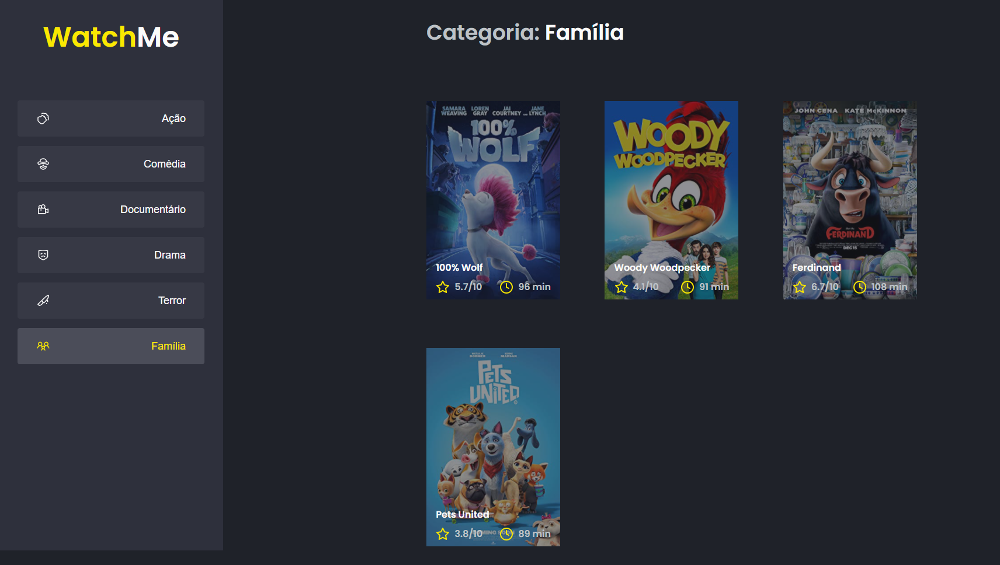

# Watch Me

# About

WatchMe was a challenge launched by Rocketseat during the Ignite bootcamp. 
<br/>
Its objective was to componentize the application, where initially all the content was in the App.tsx file, and then it was separated in the files: Content.tsx, SideBar.tsx, and Header.tsx.
<br/><br/>
The application is a list of films by genre developed as the second challenge of Ignite Trilha React JS.


# Technologies used

- <a href="https://pt-br.reactjs.org/" > React JS </a>
- <a href="https://www.typescriptlang.org/"> TypeScript </a>
- <a href="https://sass-lang.com"> SASS </a>

# How to use

1. **First clone this repository**

```bash
 git clone https://github.com/FilipeRK/Ignite-Challenge02-ReactJS-WatchMe.git
```

2. **Install dependecies**

```bash
yarn install
```

3. **Start the server (file server.json) contains the data used on this project**

```bash
yarn server
```

- The data can be acessed on **http://localhost:3333/** with: /genres or /movies

4. **Run this application**

```bash
yarn dev
```

- This project is been run in **http://localhost:8080/**

<br/><br/>

**Picture of runing application**



<p >Developed by <a href="https://github.com/FilipeRK">Filipe Kohls </a>
